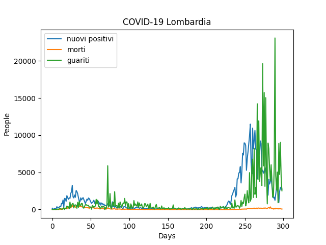

# covidcharts
[](https://github.com/ellerbrock/open-source-badges/)

🖥 A CLI tool that creates charts about Covid-19 in Italy (Regions)

🇮🇹 Tool interamente in italiano, fornisce grafici (come nell'immagine qui sotto) riguardanti l'andamento del Covid-19 in ogni regione.

🌐 I dati sono presi dall'account ufficiale della Protezione Civile su GitHub (https://github.com/pcm-dpc/COVID-19)

## Dependencies
Il tool usa le librerie
- requests (per prendere i dati)
- matplotlib (per creare il grafico)

## How to run
Installare con pip le librerie sopra riportate, poi avviare la script, dovreste ricevere questo output.
Ora non resta che selezionare dare in input il numero della regione di interesse e premere invio 🚀

```bash
python3 covidgraph.py

= Menù Regioni =
1: Abruzzo                       12: P.A. Bolzano
2: Basilicata                    13: P.A. Trento
3: Calabria                      14: Piemonte
4: Campania                      15: Puglia
5: Emilia-Romagna                16: Sardegna
6: Friuli Venezia Giulia         17: Sicilia
7: Lazio                         18: Toscana
8: Liguria                       19: Umbria
9: Lombardia                     20: Valle d\'Aosta
10: Marche                       21: Veneto
11: Molise

Inserire il numero della regione:
```

